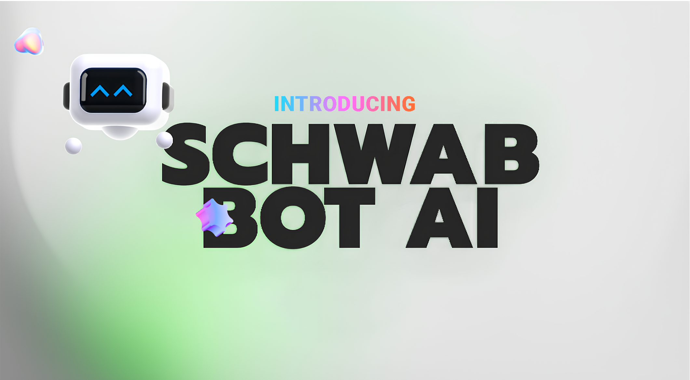

# SchwabBot


Our app empowers individuals by providing key metrics essential for stock valuation, from balance sheets to cash flow. It’s designed to educate users, helping them understand the financial indicators that drive investment decisions.

Check it out [here](https://schwab-bot.netlify.app/)!

## Table of Contents

- [Installation](#installation)
- [Usage](#usage)
- [Acknowledgments](#acknowledgments)

## Installation

1. Clone the repository:
   ```bash
   git clone https://github.com/chreamy/Options-Trade.git
   ```
2. Navigate to the project directory:
   ```bash
   cd Options-Trade
   ```
3. Install the required dependencies:
   ```bash
   npm install
   ```

## Usage

Instructions for using your project, including any examples. 

```bash
npm start
```


## Acknowledgments

- Special thanks to Chris

---
